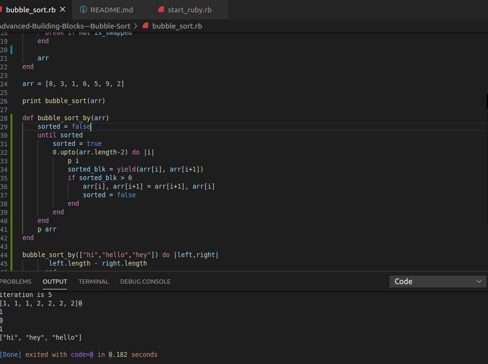

# Advanced-Building-Blocks---Bubble-Sort
This project is the first one in Ruby module at Microverse. In this project, we implemented the bubble sort algorithm. Assignment is focused on the use of yield and passing a block to a method. The project was implemented using two methods.
the first method involves creating a variable "is_swapped" and setting it to false. Then Looping through the block with the variable checking if the elements are swapped. The iteration will stop once the variable "is_swapped" becomes true.

The second method uses the yield method with the created variable "sorted" initially set to "false". The yield method is use to pass the two arguments to the block after using the "upto" method to iterate over the length of the array, excluding the last element. If the sorted_blk is positive, then we reverse the order on the array. Once the sorted variable becomes true, the iteration stops and the sorting is complete.

## Built With

- Ruby

## Getting Started

This project involves using the ruby logics to sort a list of arr into order. 

### Prerequisites

To get this project up and running, you must have Ruby installed on your machine.

### Installation

**To get this project set up on your local machine, follow these simple steps:**

- Clone the github repository git@github.com:daviidy/Advanced-Building-Blocks---Bubble-Sort.git on your local machine
- Cd into the clone folder
- Add Ruby github/workflows
- After creating the bubble_sort method and the bubble_sort_by method on the clone folder.
- Install ruby extension pack on your IDE or code editor
- right click and click run to test your codes if it passed the test. If passed;
- Run rubocop on your working folder
- Fix errors
- stage, commit, push to the created remote branch(feature-branch) on github and create a pull request.

## Author

👤 **Eric Enaburekhan**

- Github: [@enaburekhan](https://github.com/enaburekhan)
- Twitter: [@enaburekhaneric](https://twitter.com/enaburekhaneric)
- Linkedin: [@ericenaburekhan](https://www.linkedin.com/in/eric-enaburekhan-801a28100/)

👤 **David Yao**

- Github: [@daviidy](https://github.com/daviidy )
- Twitter: [@DavidYao3](https://twitter.com/DavidYao3)
- Linkedin: [@DavidYao](https://www.linkedin.com/in/david-yao-6bb95299/ 
daviidy )

## Show your support

If you've read this far, you must like the project! Give me a ⭐️!

## Acknowledgments

- My thanks also goes to Microverse and all our peers and colleagues there.
